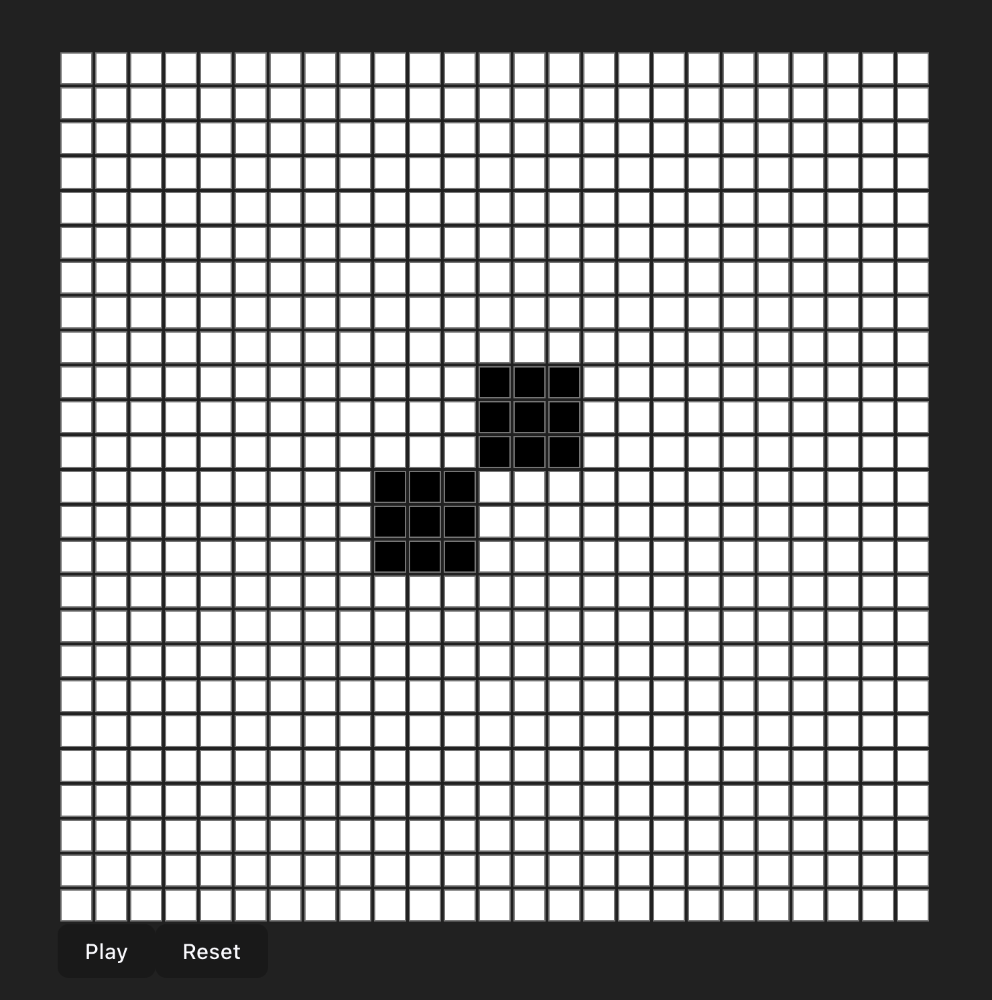

# Conway's Game of Life React Vite Application

## Overview

This is a simple and efficient implementation of Conway's Game of Life using React and Vite. The application demonstrates how to build a performant Game of Life simulation with React and Vite build tools. Users can interact with the game grid, control the simulation, and reset the grid.

## Quick Start Instructions

1. Clone the repository: `git clone https://github.com/tmcarmichael/conways-game-of-life-vite-react.git`
2. Change to the project directory: `cd  conways-game-of-life-vite-react`
3. Install dependencies: `npm install` or `yarn`
4. If you don't have Vite installed, install it globally: `npm install -g create-vite` or `yarn global add create-vite`
5. Start the development server: `npm run dev` or `yarn dev`
6. Open your browser and navigate to `http://localhost:5173` or the port your CLI directs you to.

Next, with the web app running, click some cells, they will change color, then click start too see the Conway's Game of Life iteration. You can start with a simple [Figure Eight](https://conwaylife.com/wiki/Figure_eight) that repeats, shown below.

  

## Conway's Game of Life

Conway's Game of Life is a cellular automaton devised by the British mathematician John Horton Conway in 1970. Conway's Game of Life demonstrates emergent complexity arising from simple rules. The game consists of a grid of cells, each of which can be in one of two states: alive or dead. The state of each cell in the next generation is determined by the number of its alive neighbors according to the following rules:

1. Any live cell with two or three live neighbors survives.
2. Any dead cell with exactly three live neighbors becomes a live cell.
3. All other live cells die in the next generation, and similarly, all other dead cells stay dead.

Despite its simplicity, Conway's Game of Life can produce surprisingly complex patterns and has been used to model various real-world systems. This React Vite application serves as an interactive tool to explore and visualize the fascinating behavior of the Game of Life.

## More info

https://en.wikipedia.org/wiki/Conway%27s_Game_of_Life

https://conwaylife.com/

https://conwaylife.com/wiki/Figure_eight